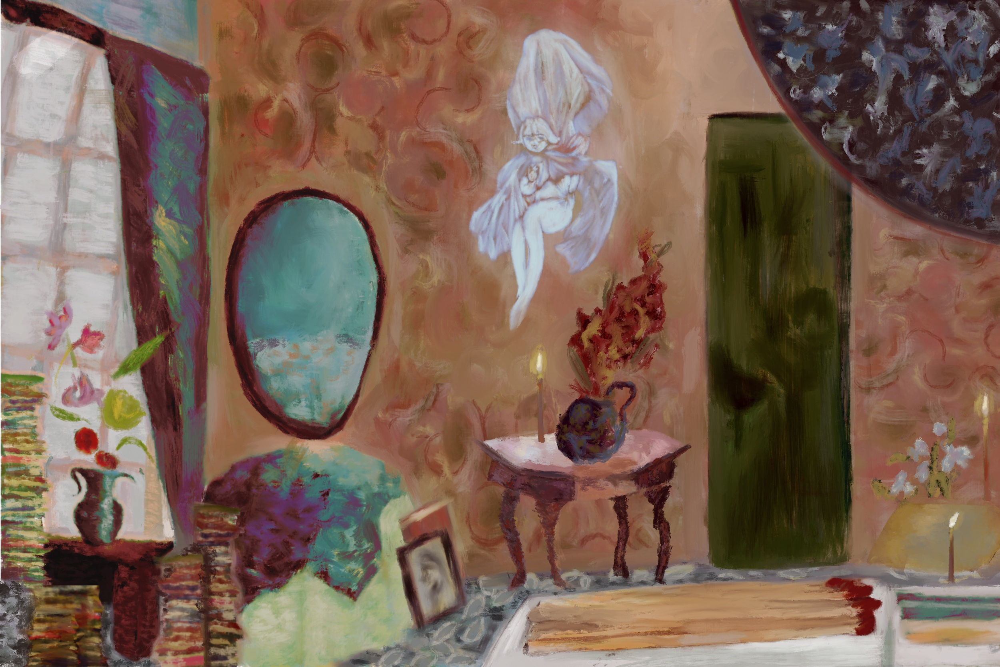

# chlomendoz.github.io
#Portfolio for CLA 101

<!DOCTYPE html>
<html lang="en">

<head>
    <meta charset="UTF-8">
    <meta name="viewport" content="width=device-width, initial-scale=1.0">
    <title>Document</title>

    <title></title>
    <link rel="stylesheet" href="css/style.css">
</head>

<body>
    <h1>Chloe Mendoza</h1>
    <h2>Freelance Writer and Artist</h2>
    

    <h3>About Me</h3>
    
Brooklyn-based Bookseller, Copy Writer, and Digital Artist

    <a href="chloepage1.html">Click Here for Recent Collaborations</a>
    <a href="resume.html">Click Here For Resume</a>
    <a href="comicsandprints.html">Click Here For Comics and Prints</a>
</body>

</html>
